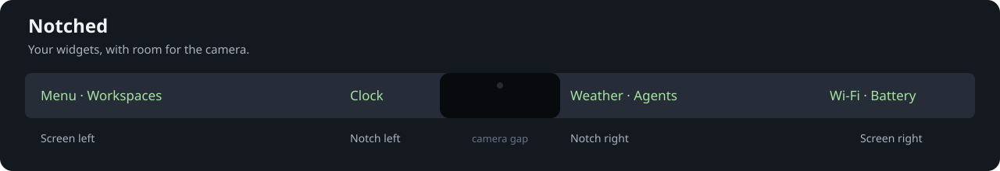

# Notched

An Omarchy bar that makes room for the MacBook camera notch.

Keep your existing widgets and theme, then drag widgets to the screen edges or
right beside either side of the camera. Crowded groups wrap onto additional rows
and reserve the extra height so application windows stay below the bar.
Reordering within a group keeps live widgets mounted. Moving between groups
reloads only the moved widget rather than rebuilding the entire bar.



## Install

```bash
omarchy plugin add https://github.com/wesleygrimes/omarchy-notched.git --enable
```

The plugin replaces the active bar while keeping your widget layout and settings.
It uses the Quickshell and Hyprland components already shipped with Omarchy;
there are no additional runtime packages or system services to install.

This initial release is experimental. See [known issues](docs/known-issues.md)
for the native Quickshell crash observed during a rapid bar switch/restart.

**Requirements:** Omarchy Quattro with the Quickshell plugin system, an Apple
Silicon MacBook, and the full notched display area already exposed by Asahi.
Tested on Omarchy 4.0.2 and a 16-inch M2 Pro MacBook Pro at 2x display scale.
The split applies to the top bar on the built-in display. External monitors and
bars on other screen edges keep the usual layout.

## Place your widgets

Drag any bar widget to one of four destinations:

| Destination | Where to drop | Saved section |
| --- | --- | --- |
| Screen left | Outer half of the left wing | `left` |
| Notch left | Inner half of the left wing | `center`, `notchSide: "left"` |
| Notch right | Inner half of the right wing | `center`, `notchSide: "right"` |
| Screen right | Outer half of the right wing | `right` |

Empty notch groups accept drops too. Drop on an existing widget to reorder its
group. The camera gap rejects drops. Changes save through Omarchy's normal
shell configuration and survive a restart. Widget settings travel with widgets.

Existing center widgets initially sit on the left of the notch; drag individual
widgets across to arrange the right side. No divider widget is needed.
On a display without a notch, both center groups render together in the normal
center section. The usual `centerAnchor` still applies there.

## Calibrate the notch

Optional settings belong inside the existing `bar` object in
`~/.config/omarchy/shell.json`. Merge these keys into your configuration; keep
your current layout and other settings:

```json
"notch": {
  "width": 360,
  "padding": 2
}
```

| Setting | Default | Units / behavior |
| --- | --- | --- |
| `width` | `360` | Physical pixels; divided by the display scale |
| `height` | Automatic | Optional physical pixel override |
| `padding` | `2` | Logical pixels between a widget group and the camera gap |
| `enabled` | `true` | Set `false` to use the normal unsplit layout |

The defaults were tuned visually on a 16-inch M2 Pro at 2x scale. Other MacBook
panels may need a different width. Increase it if icons meet the camera; reduce
it if the gap is too wide. Padding can be zero.

Height detection comes from Omarchy's panel geometry: Pro 14/16-inch and Air
13.6/15-inch resolutions are recognized, with an aspect-ratio fallback for other
internal panels. Those other models have not been tested on hardware here.
Omarchy's theme `notch-height` can also raise the minimum bar height.

The shell reloads configuration on save. After plugin code changes or updates,
restart it to avoid cached QML components.
Let the bar finish loading before requesting a restart; a fresh installation
normally activates without one.

## Migrating from 0.1.x

Version 0.2.0 changes the plugin ID from `pro.grimes.notched` to
`ncfrontiersman.notched`. An existing checkout does not automatically move to the new
plugin directory. Switch to the built-in bar, remove the old installation, then
install the new ID:

```bash
omarchy bar use omarchy.bar
omarchy plugin remove pro.grimes.notched
omarchy plugin add https://github.com/wesleygrimes/omarchy-notched.git --enable
```

Keep your `bar.layout`, `notchSide`, and `bar.notch` settings. The new installation
uses them without rearranging your widgets.

## Update or switch back

```bash
omarchy plugin update ncfrontiersman.notched
omarchy restart shell
```

Switch to the built-in bar without removing Notched:

```bash
omarchy bar use omarchy.bar
```

Switch back:

```bash
omarchy bar use ncfrontiersman.notched
```

To uninstall, first switch back to the built-in bar, then run:

```bash
omarchy plugin remove ncfrontiersman.notched
```

Your widgets remain in their sections. The stock bar ignores `notchSide` and
`bar.notch`; you can remove those optional keys if you want to tidy the config.

## Scope

Notched arranges bar widgets around the physical cutout. It does not change
Hyprland's pointer geometry, so the cursor can still enter the hidden area.
Widget popups remain managed by their original plugins and the Omarchy shell.

This plugin contains a fork of Omarchy's bar and uses the host's `qs.Commons`
and `qs.Ui` modules. Compatibility with future shell releases needs verification
when those interfaces change. See [UPSTREAM.md](UPSTREAM.md) for the base files.

## Development

```bash
bash scripts/check.sh
```

Checks require Node.js, Qt 6's `qmltestrunner` and QtTest QML module, and an
installed Omarchy CLI. These test tools are only development dependencies.
The tests cover live widget identity, screen scaling, cutout detection, four drag
destinations, camera exclusion, and preserving settings while moving widgets.
GitHub Actions runs the portable tests, Qt model tests, and package metadata checks.

## Next

- Visual calibration of width and padding without editing JSON.
- Highlight all four destinations while dragging.
- Optional overflow drawer for users who prefer a single bar row.
- Per-display layout preferences.

These are planned improvements, not features of the initial release.

## License

MIT. The bar and base model are derived from Omarchy, copyright David Heinemeier
Hansson. Notched's changes are copyright 2026 Wes Grimes.
